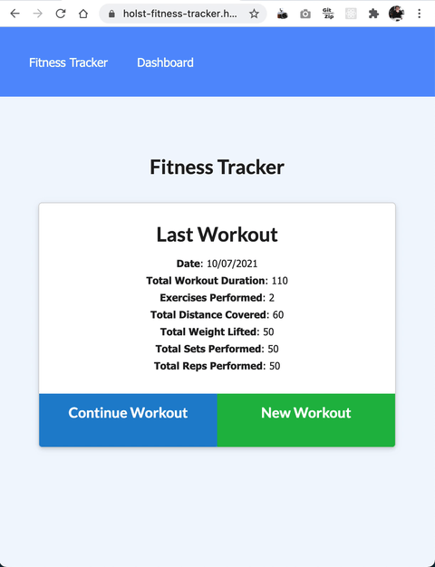

# Fitness Tracker

This is a fitness tracking app that allows multiple types of exercises to be recorded on a single session. It allows the users to stats in the form of graphs about their workouts over time. All frontend code was supplied.

## Table of Contents:

- [Live Deploy](#Live-Deploy)
- [Screenshots](#Screenshots)
- [Technology Stack](#Technology-Stack)
- [Usage](#Usage)
- [Tests](#Tests)
- [Questions](#Questions)

## Live Deploy

A live deploy of this app can be found on Heroku at: https://holst-fitness-tracker.herokuapp.com/

## Screenshots

#### Animated Gif Screenshot:



## Technology Stack

- heroku: https://www.heroku.com/
- mongo atlas: https://www.mongodb.com/cloud/atlas
- mongoose: https://www.npmjs.com/package/mongoose
- express: https://www.npmjs.com/package/express
- WesBos Linting Config: https://github.com/wesbos/eslint-config-wesbos

## Usage

This software needs access to a mongoDB database for storage of persistent information. For local deployment/testing all database credentials should be stored in `.env`. An example has been provided.

To use the program simply run the program from your preferred terminal and follow the prompts.

```bash
npm start
```

To prefill the database use the included seed files.

```bash
npm run seed
```

## Tests

No tests have been written for this software.

## Questions

If you have any further questions you can get in contact with the creator through the following methods:

- https://github.com/daveholst/
- dholst@glenholst.com.au
